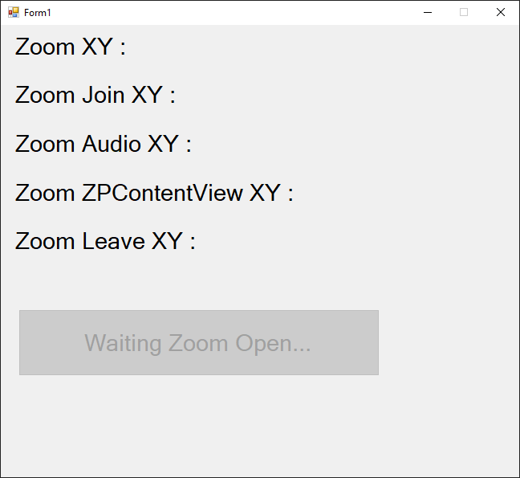

## ZoomXY

Welcome to ZoomXY, also known as `ZoomXY`.

This project was developed to automate Zoom meetings, specifically for use in my school when we needed to join class meetings. 

ZoomXY helps by getting the XY coordinates of elements on the Zoom screen, making it easier to set up screen positions and automate interactions with those elements during clicks.

## Update for 2024

I developed this script during high school (F3-F4, 2018-2019). Previously, this project was closed-source, but I’ve decided to open-source it now.

### Will You Continue Development?

As I now use GNU/Linux as my daily-driven for a long time, Windows software is no longer a priority for me. Therefore, I’m not focusing on Windows-related updates and i prefer to work on GNU/Linux.

for short. `No`.

